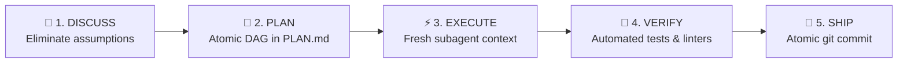
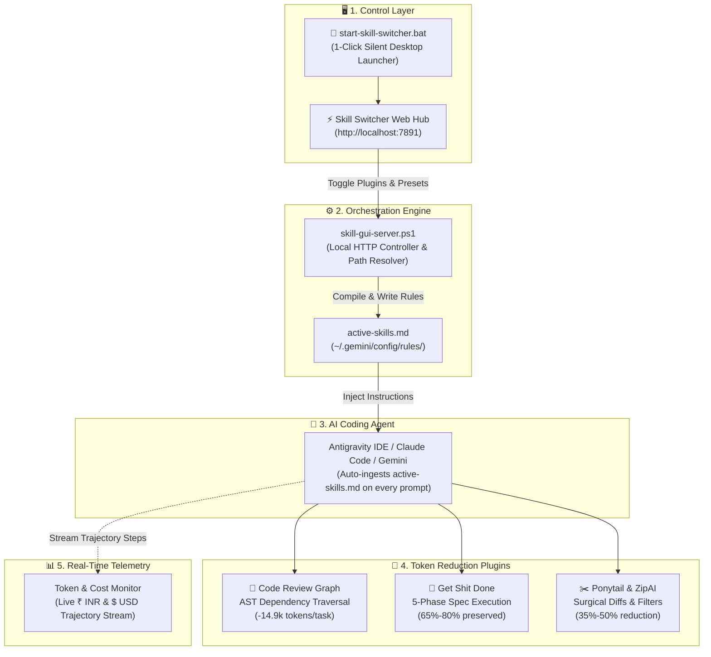

# Skill Switcher

<p align="center">
  <strong>Dynamic AI Skill Orchestrator, Token Reduction Plugins & Context Rules Manager</strong>
</p>

<p align="center">
  <em>Built for Antigravity IDE, Claude Code, and Gemini CLI</em>
</p>

<p align="center">
  <a href="#-quick-start"></a>
  
  
  
  
  
  
</p>

<p align="center">
  <a href="#-quick-start">Quick Start</a> •
  <a href="#-how-it-works">How It Works</a> •
  <a href="#-visual-benchmarks--comparison-charts">Benchmarks</a> •
  <a href="#-core-modules">Core Modules</a> •
  <a href="#-plugins--token-reduction-hub">Plugins Hub</a> •
  <a href="#-token--cost-monitor">Token Monitor</a> •
  <a href="#-the-shelf">The Shelf</a> •
  <a href="#-reference--deep-dives">Reference & Shortcuts</a>
</p>

---

## 🌟 Overview

**Skill Switcher** is an offline-first, developer-grade orchestrator designed to eliminate prompt fatigue, context bloat, and token waste in AI pair-programming sessions.

Modern AI coding agents (Antigravity IDE, Claude Code, Gemini CLI, Cursor) ingest custom rules from:
```
~/.gemini/config/rules/active-skills.md
```
Instead of manually copying rules or bloating your context window with all skills at once, Skill Switcher lets you **activate, inspect, and hot-swap specialized skills and token-reducing plugins with 1 click**.

---

## ⚡ Quick Start

### 1. Launch with One Click (Windows)

Simply double-click:
👉 **`start-skill-switcher.bat`**

- Starts the local backend daemon silently in the background (no lingering terminal clutter).
- Automatically launches your default browser to **`http://localhost:7891`**.
- If already running, instantly brings up your dashboard without duplicate instances.

> [!TIP]
> **Desktop Shortcut**: Right-click `start-skill-switcher.bat` ➔ **"Send to"** ➔ **"Desktop (create shortcut)"** to launch anytime from your Windows desktop!

### 2. Launch Script Reference

| File | Purpose | Recommended For |
|---|---|---|
| **[`start-skill-switcher.bat`](start-skill-switcher.bat)** | **1-Second Silent Background Launcher** | **Daily use (Windows)**. Starts daemon and opens browser. |
| **[`skill-gui.bat`](skill-gui.bat)** | Foreground Web GUI Server | Windows users who want to see live HTTP console logs. |
| **[`skill-gui.sh`](skill-gui.sh)** | Shell Script Launcher | macOS / Linux workstations (`chmod +x skill-gui.sh && ./skill-gui.sh`). |
| **[`skill-loader.bat`](skill-loader.bat)** | Interactive Terminal CLI Menu | Terminal-only keyboard workflow in PowerShell (no browser needed). |
| **[`index.html`](index.html)** | 100% Offline Static UI | Zero servers required; select skills and copy prompts directly. |

---

## 🔄 How It Works

```
┌─────────────────────────────────┐      1-Click Apply      ┌─────────────────────────────────────────┐
│      Skill Switcher Hub         │  ═════════════════════> │ ~/.gemini/config/rules/active-skills.md │
│ (Web GUI, Presets, Plugins Hub) │                         │ (Auto-read by AI Agent every session!)  │
└─────────────────────────────────┘                         └─────────────────────────────────────────┘
```

1. **Select skills or presets** in the GitHub Primer dashboard (e.g. *Frontend Motion* or *Ultra-Low Token Mode*).
2. Click **"Apply to Antigravity Memory"** (or toggle any plugin in the Plugins Hub).
3. Skill Switcher dynamically compiles the active rules and writes them to `active-skills.md`.
4. Your AI coding agent automatically operates with those specialized capabilities.
5. When your task changes, switch presets or click **"Wipe Memory"** to clean your context window.

---

## 📊 Visual Benchmarks & Comparison Charts

### 1. Token Reduction & Cost Benchmarks

| Configuration | Context Burn / Task | Avg. Cost (₹ INR) | Avg. Cost ($ USD) | Efficiency Gain |
|---|---|---|---|---|
| **❌ Vanilla Assistant (No Plugins)** | `[████████████████████]` **180k tokens** | ₹42.50 | $0.49 | Baseline (0%) |
| **🌳 + Code Review Graph** | `[██████████████░░░░░░]` **125k tokens** | ₹29.50 | $0.34 | **+30.5% Saved** |
| **✂️ + Ponytail & ZipAI Verbosity** | `[████████░░░░░░░░░░░░]` **75k tokens** | ₹17.70 | $0.20 | **+58.3% Saved** |
| **⚡ Ultra-Saver (CRG + GSD + Ponytail)** | `[███░░░░░░░░░░░░░░░░░]` **35k tokens** | ₹8.20 | $0.09 | **+80.5% Saved ⚡** |

---

### 2. Autonomous Execution Loop (GSD Framework)



---

### 3. Feature Comparison Matrix

| Workflow Dimension | ❌ Vanilla AI Coding Assistant | ⚡ With Skill Switcher & Plugins Hub |
|---|---|---|
| **Context Window Hygiene** | Suffers severe **Context Rot** as redundant logs and chat accumulate. | **Spec-Driven Milestones (GSD)** with clean subagent context and persistent `PLAN.md`. |
| **Codebase Navigation** | Blind recursive Grep & reading full files (**15k–50k tokens** wasted). | **AST Knowledge Graph (`code-review-graph`)** queries exact symbol radius (**100–300 tokens**). |
| **Conversational Conciseness** | Repetitive preamble, polite disclaimers, and rambling explanations. | **Surgical Diff Enforcement (`ponytail`)** + 38 Anti-Slop precision writing rules. |
| **Terminal & Shell Output** | Unbuffered stdout/stderr dumps flood and blow the context window. | **Regex Truncation (`zipai-optimizer`)** prevents overflow from minified logs. |
| **Cost & Token Transparency** | Blind spend until month-end invoice; zero per-turn tracking. | **Real-Time Telemetry Engine** streaming **₹ INR** & **$ USD** per turn from trajectory logs. |
| **Rule & Skill Switching** | Tedious manual editing of hidden dotfiles and markdown rules. | **1-Click Primer GUI & Presets** with instant two-way disk synchronization. |

---

### 4. Modern System Architecture



---

## 🧩 Core Modules

### 1. 🎛️ Skills & Presets Engine
Manage over **105+ battle-tested skills** categorized into ready-to-use 1-click stacks:
- 🎨 **Frontend Motion** — GSAP Core, ScrollTrigger, Motion Dev, Impeccable, Better Icons.
- ⚡ **JEV DOM Loop** — Sub-second headless browser automation, Drone spatial engine, Canny verifier.
- ✍️ **Anti-Slop & Precision** — Miqdad Badjuber's 38 anti-fluff rules + ASD-STE100 Controlled English.
- 🔁 **Ralph Loop** — Autonomous test-driven agent loop with self-correcting git commits.
- 🏗️ **AI & ML Architect** — 8-stage production AI stack (Classical ML to RAG & MLOps).
- 🧠 **Laya System 1 Playground** — Non-autoregressive fast classification running in 1–33ms with 0 token burn.

---

### 2. 🔌 Plugins & Token Reduction Hub (`/pages/plugins.html`)

A dedicated command center for activating structural MCP servers and context compression systems:

| Plugin | Type | Token Impact | How It Delivers Value |
|---|---|---|---|
| **🌳 Code Review Graph** | AST Knowledge Graph | **~14.9k saved / task** | Replaces recursive Grep and multi-file scans with symbol dependency graphs (`semantic_search_nodes`, `get_impact_radius`). Injects full decision matrix into `active-skills.md`. |
| **🎯 Get Shit Done (GSD)** | Autonomous Workflow | **65%–80% preserved** | Eliminates context rot and hallucination loops via the 5-phase cycle (`DISCUSS` ➔ `PLAN` ➔ `EXECUTE` ➔ `VERIFY` ➔ `SHIP`), fresh subagent milestones, and persistent `PLAN.md`. |
| **✂️ Ponytail Optimizer** | Instruction Compressor | **35%–50% reduction** | Strips conversational pleasantries and enforces surgical, single-target code diffs. |
| **⚡ OmniRoute & RTK** | Token Router & Cache | **40%–60% reduction** | Lossless prompt compression and dynamic context budgeting. |
| **🗺️ Graphify** | Architecture Indexer | **~25k saved / session** | Pre-indexes codebase AST dependencies into `GRAPH_REPORT.md`. |
| **🗜️ ZipAI Verbosity Filter** | Output Truncator | **40%–60% log savings** | Limits unbuffered terminal dumps and minified JS spills. |
| **💾 Gemini Prompt Caching** | Cloud Acceleration | **86% billing discount** | Pins static prompt prefixes in Google Cloud RAM. |

#### 1-Click Optimization Presets:
- ⚡ **Ultra-Low Token Mode**: Activates all savers for **70%+ context reduction**.
- ⚖️ **Balanced Precision Mode**: Balances high token efficiency with type safety.
- 🚀 **Baseline Standard Profile**: Restores minimal baseline configuration.

---

### 3. 📊 Token & Cost Telemetry Monitor (`/pages/token-monitor.html`)

Real-time, zero-overhead telemetry dashboard streaming directly from Antigravity session trajectories (`transcript.jsonl`):
- **Dual Currency Tracking**: Primary in **₹ INR** (@ benchmark ₹86.50/USD) with instant **$ USD** toggle.
- **Interactive Visualizations (Chart.js)**: Stacked Bars, Spline Gradient Area, and Cumulative Burn-up curves across 7D, 14D, 30D, and 90D timeframes.
- **Cost Estimator & Forecaster**: Model hypothetical context runs across Gemini Flash, Gemini Pro, Claude Sonnet, Claude Haiku, and GPT-4o.
- **Budget Alerts**: Configurable rolling 5-hour, weekly, and monthly budget limits with threshold warnings.
- **Lock-Free Streaming**: Reads logs safely via `[System.IO.FileShare]::ReadWrite` without invoking extra LLM queries.

---

### 4. 📚 The Shelf — Technology Discovery Library

High-speed engineering repository and design inspiration graph:
- **5-Second Quick Capture**: Save any URL directly into your Inbox from the top bar or via the **1-Click Browser Bookmarklet**.
- **Dual-Context Capture**: Records both *"💭 Why I saved this"* (aesthetic/mechanism) and *"🚀 Potential use"* (codebase application).
- **Curated Topic Collections**: Visual folders for *Design & Visual Identity*, *React & Animation Engines*, *Typography*, *CRO & Growth*, *AI Tools*, and *Developer Tools*.
- **3 View Density Modes**: Focused Grid, Detailed Grid, and Dense Table List.
- **Export & Citations**: 1-click Markdown citations (`📋 MD`), filtered list exports, and full JSON backups.

---

## 🌐 Dynamic Universal Path Resolution

Skill Switcher is **100% portable** across any PC, username, or operating system:

| What | How It Is Resolved at Runtime |
|---|---|
| User Profile | `%USERPROFILE%` / `$HOME` profile root |
| Antigravity Config | `<home>/.gemini` |
| Active Rules Path | `<home>/.gemini/config/rules/active-skills.md` |
| Global Skills | `<home>/.gemini/config/skills` |
| Session Telemetry | `<home>/.gemini/antigravity-ide/brain` (auto-detects fallback paths) |
| Skill File Pointers | Dynamic absolute paths pointing to your local clone |

*Paths are verified and displayed directly in the dashboard under System Environment.*

---

## 📖 Reference & Deep Dives

<details>
<summary><strong>⌨️ Keyboard Shortcuts</strong></summary>

### Web GUI (Shelf & Dashboard):
- <kbd>/</kbd> — Focus search bar
- <kbd>n</kbd> or <kbd>+</kbd> — Open "+ Add Resource" modal
- <kbd>1</kbd> — Switch to Card Grid view
- <kbd>2</kbd> — Switch to Dense Table view
- <kbd>m</kbd> — Export `DISCOVERY-LIBRARY.md`
- <kbd>b</kbd> — Export JSON Backup
- <kbd>Esc</kbd> — Clear filters / Close modals

### Interactive CLI (`skill-loader.bat`):
- `1` – `11` — Toggle individual skill packs
- `A` — Apply active selection to disk
- `S` — Status check
- `W` — Wipe / reset memory
- `C` — Combo mode (e.g., `1,3,9`)
- `X` — Copy rules to clipboard
- `Q` — Quit

</details>

<details>
<summary><strong>📁 Repository Directory Structure</strong></summary>

```
Skills-Switcher/
├── .agents/skills/              # Bundled skills (code-review-graph, getshitdone, laya, etc.)
├── css/                         # Modular GitHub Primer design tokens & layout
├── js/
│   ├── data/                    # Repository catalogs, presets, and shelf store
│   ├── state/                   # Application state engine
│   ├── services/                # API client, key vault, and telemetry engine
│   └── ui/                      # Feed, modals, and shelf UI components
├── pages/
│   ├── plugins.html             # Plugins & Token Reduction Hub
│   └── token-monitor.html       # Live Token & Cost Telemetry Monitor
├── start-skill-switcher.bat     # 1-Click Silent Windows Launcher (Recommended)
├── skill-gui.bat                # Foreground Web GUI Launcher
├── skill-gui-server.ps1         # Backend HTTP Server & REST API
├── skill-loader.bat             # Interactive Terminal CLI Launcher
├── index.html                   # Main GitHub Primer Web Dashboard
└── README.md                    # Project Documentation
```

</details>

<details>
<summary><strong>❓ Troubleshooting & FAQ</strong></summary>

- **Port 7891 in use?** The server automatically probes consecutive ports up to `7911`. You can also run `.\skill-gui-server.ps1 -Port 8080`.
- **PowerShell script execution disabled?** Both `.bat` files automatically invoke PowerShell with `-ExecutionPolicy Bypass`, running out of the box without changing system-wide security settings.
- **How to confirm agent picked up active skills?** In your AI session, ask: *"Confirm active skills loaded in memory."* The agent will output its active instruction headers from `active-skills.md`.
- **Add custom skills?** Place any folder into `.agents/skills/<name>/` containing a `SKILL.md` file. It will be discovered and verified automatically.

</details>

---

## 🤝 Contributing & License

Contributions are warmly welcomed! Please submit PRs or open an issue.

Licensed under the [MIT License](LICENSE) &copy; 2026 **Doctor9Trio**.
